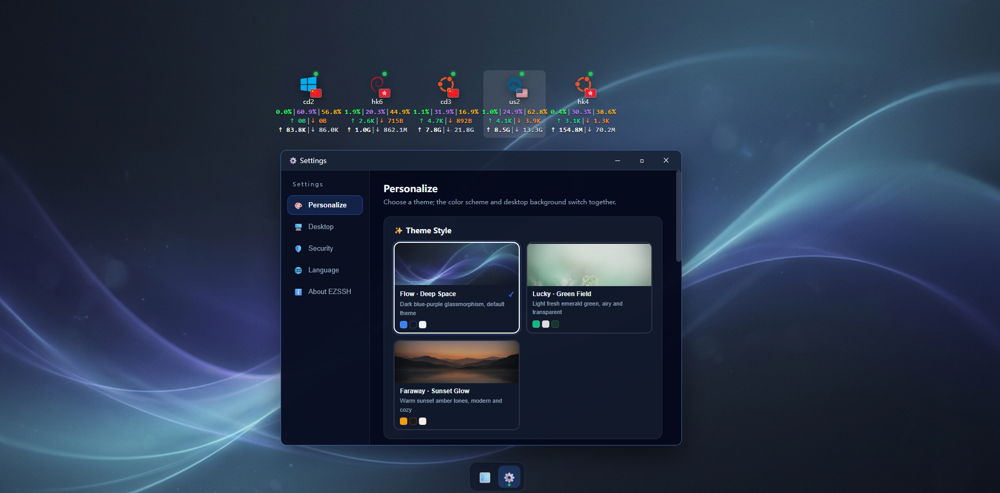
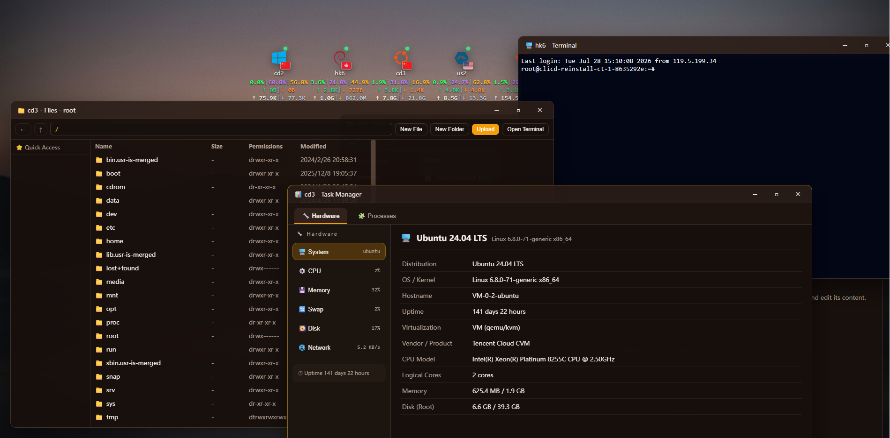

# EZSSH

> [English](README.en.md) | 简体中文

版本：v0.0.1

**干净、高效、可视化的自托管中心化 SSH Web 网关，GO驱动**：仅依赖目标机的原生 SSH / SFTP 服务，无需在服务器上安装任何 Agent，也不开放额外端口，安全可控。

如果你想要更详细的内容请查看[用户手册](doc/user-guide.md)

## 预览

<p align="center">
  
  <br/>
  
</p>

## 快速开始

### 1. 一键安装（复制粘贴即可）

```bash
bash <(curl -fsSL https://raw.githubusercontent.com/pureages/EZSSH/main/scripts/install.sh)
```

脚本直接从 GitHub Releases 下载预编译产物（服务端 + 终端 Agent + 前端界面），**无需安装 Go / Node.js，也不会拉取源码**，安装完成后自动进入初始化向导。

> 支持 Linux / macOS / Windows(msys)。也可从源码构建：`git clone https://github.com/pureages/EZSSH.git && cd EZSSH && bash scripts/install.sh`

### 2. Docker 部署

```bash
docker build -t ezssh .
docker run -d --name ezssh -p 49466:49466 \
  -v ezssh-data:/app/data \
  ezssh
```

### 3. 自行构建

**环境要求**:Go 1.22+（构建后端）、Node.js 20+ 与 npm（仅构建前端时需要）。

```bash
# 后端
go build -buildvcs=false ./cmd/ezssh
./ezsshd

# 前端（可选，后端也可直接托管 web/dist）
cd web && npm install && npm run build
```

默认监听 `127.0.0.1:49466`（可用环境变量 `EZSSH_LISTEN` / `EZSSH_PORT` 覆盖）。

## License

[MIT](LICENSE)
